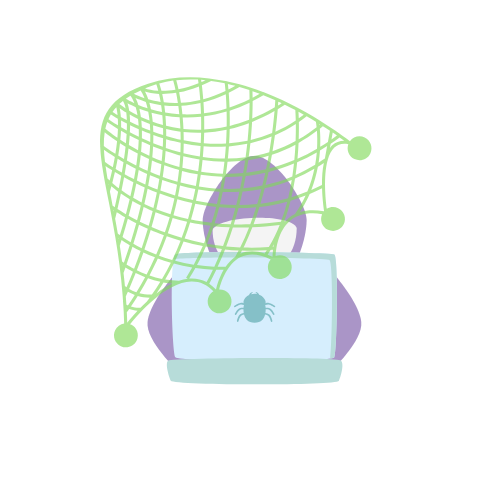

    

# PhishNet
Your AI-powered shield against phishing. Detect threats, learn with interactive quizzes, and stay safe from malicious texts, emails, tweets, and URLs—right from your browser.

This app was made for Hacklytics 2025 at Georgia Tech.

Watch the demo here: https://youtu.be/cKemeIPhQCk

Presentation: https://www.canva.com/design/DAGf4uCPoq4/CjhXwroI3vKfgqdKF8bmew/edit

Install the extension on the Chrome Web Store: https://chromewebstore.google.com/detail/phish-net/lllecpchjhllolknfecnhmjdjmlameog

## Inspiration
With the rise of phishing attacks on social media, emails, and messaging platforms, we realized how easy it is for people to fall victim to malicious links and deceptive messages. Phishing attempts don’t even include obvious scam links anymore—they use hyperlinked text that looks legitimate but redirects to malicious sites, making them even harder to detect. A single click can lead to stolen data, financial loss, or account takeovers.
We realized that many people fall for phishing scams not because they’re careless, but because phishing tactics are becoming harder to spot. Many existing security solutions are either too complex for everyday users or fail to provide real-time, interactive learning. 

## Our solution: **PhishNet**!
Phishnet is a Chrome extension designed to help users identify and safeguard themselves from malicious texts, emails, tweets, and URLs across platforms like X and Gmail. It runs as an add-on in the browser, analyzing text and giving posts a maliciousness score using machine learning models. Clicking the info icon provides more details on why a message is flagged, helping users understand and trust the detection system.
Beyond just detection, Phishnet also features an interactive quiz to train users to recognize phishing attempts. Users are shown AI-generated tweets and emails, choose whether they are malicious or safe, and highlight suspicious words. If correct, they receive positive reinforcement; if incorrect, they get an explanation of the red flags they missed—helping them improve their detection skills over time.

## Challenges we ran into
One of our biggest hurdles was sourcing quality datasets for classifying tweets and messages. The research in this area is limited—most available datasets were focused on generic spam rather than the nuanced nature of phishing content. To overcome this, we leveraged transfer learning: we adapted email datasets, which were more abundant and well-researched, and supplemented them with the limited examples of tweets and messages available. This approach allowed us to generalize our model better across different types of content.

Additionally, we encountered challenges with false positives. Relying on a single model sometimes led to misclassifications, which could erode user trust in the system. To tackle this, we deployed a variety of models in tandem, allowing them to cross-validate and refine the detection process. This multi-model strategy significantly improved our accuracy, ensuring that our maliciousness scoring is both reliable and effective.

## Future improvements
In the future, we plan to expand platform support to more complex social media networks like Instagram and TikTok, where phishing scams are becoming increasingly sophisticated. Additionally, we want to develop AI models capable of detecting malicious content in videos and voice messages, ensuring that phishing attempts extend beyond just text-based analysis. To further strengthen user education, we will introduce more advanced learning modules, including real-world phishing simulations, to help users recognize evolving threats. We also plan to implement a user-generated reporting feature, allowing users to submit suspicious messages and contribute to refining our detection model. These advancements will help Phishnet evolve into a multi-platform security tool, keeping users safe across various digital interactions.
